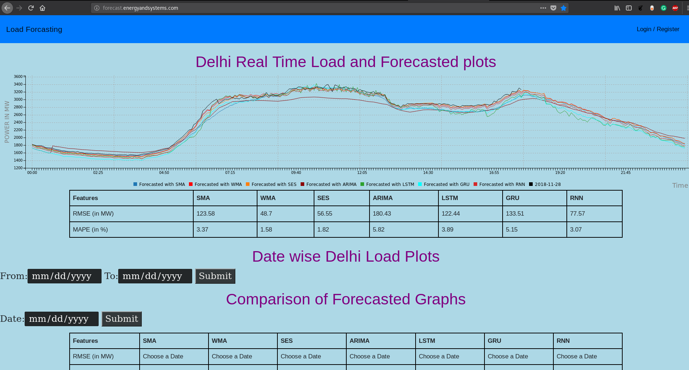

# Electric Load Forecasting

Under graduate project on short term electric load forecasting. Data was taken from [State Load Despatch Center, Delhi](www.delhisldc.org/) website and multiple time series algorithms were implemented during the course of the project.

### Models implemented:

`models` folder contains all the algorithms/models implemented during the course of the project:

* Feed forward Neural Network [FFNN.ipynb](models/FFNN.ipynb)
* Simple Moving Average [SMA.ipynb](models/SMA.ipynb)
* Weighted Moving Average [WMA.ipynb](models/WMA.ipynb)
* Simple Exponential Smoothing [SES.ipynb](models/SES.ipynb)
* Holts Winters [HW.ipynb](models/HW.ipynb)
* Autoregressive Integrated Moving Average [ARIMA.ipynb](models/ARIMA.ipynb)
* Recurrent Neural Networks [RNN.ipynb](models/RNN.ipynb)
* Long Short Term Memory cells [LSTM.ipynb](models/LSTM.ipynb)
* Gated Recurrent Unit cells [GRU.ipynb](models/GRU.ipynb)

scripts:

* `aws_arima.py` fits ARIMA model on last one month's data and forecasts load for each day.
* `aws_rnn.py` fits RNN, LSTM, GRU on last 2 month's data and forecasts load for each day.
* `aws_smoothing.py` fits SES, SMA, WMA on last one month's data and forecasts load for each day.
* `aws.py` a scheduler to run all above three scripts everyday 00:30 IST.
* `pdq_search.py` for grid search of hyperparameters of ARIMA model on last one month's data.
* `load_scrap.py` scraps day wise load data of Delhi from [SLDC](https://www.delhisldc.org/Loaddata.aspx?mode=17/01/2018) site and stores it in csv format.
* `wheather_scrap.py` scraps day wise whether data of Delhi from [wunderground](https://www.wunderground.com/history/airport/VIDP/2017/8/1/DailyHistory.html) site and stores it in csv format.

`server` folder contains django webserver code, developed to show the implemented algorithms and compare their performance. All the implemented algorithms are being used to forecast today's Delhi electricity load [here](http://forecast.energyandsystems.com) [now deprecated]. Project report can be found in [Report](Report) folder. 

### Team Members:

* Ayush Kumar Goyal
* Boragapu Sunil Kumar
* Srimukha Paturi
* Rishabh Agrahari
